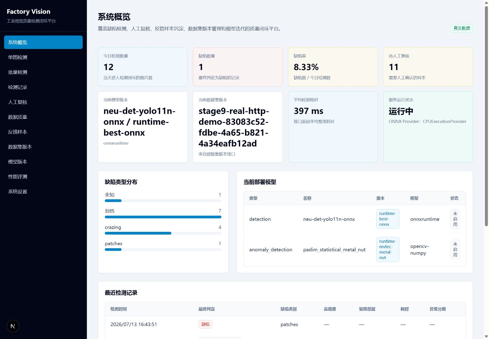
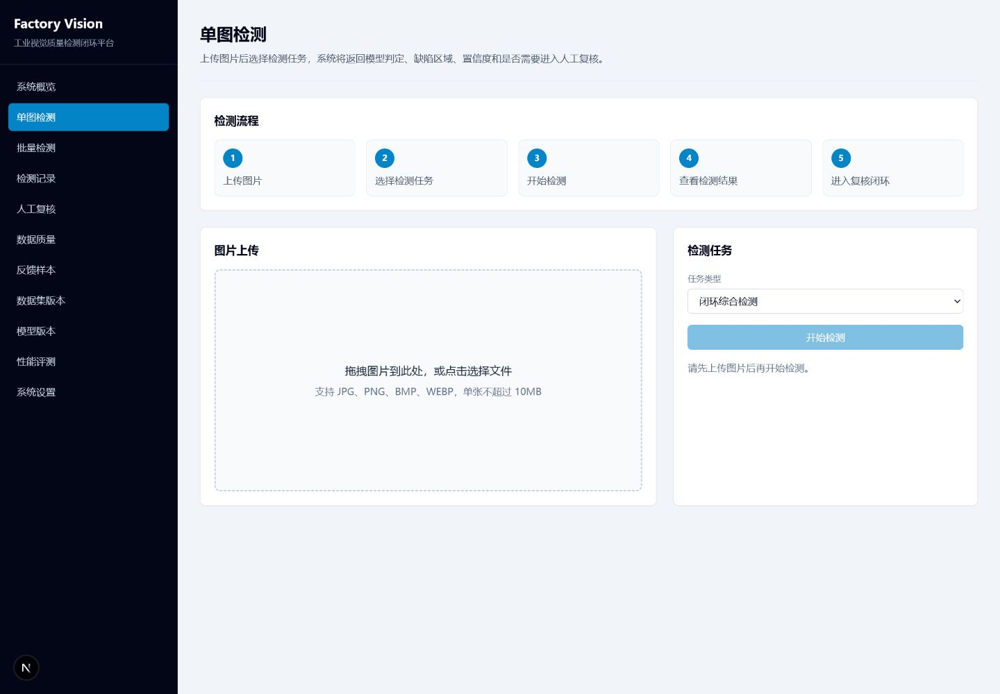
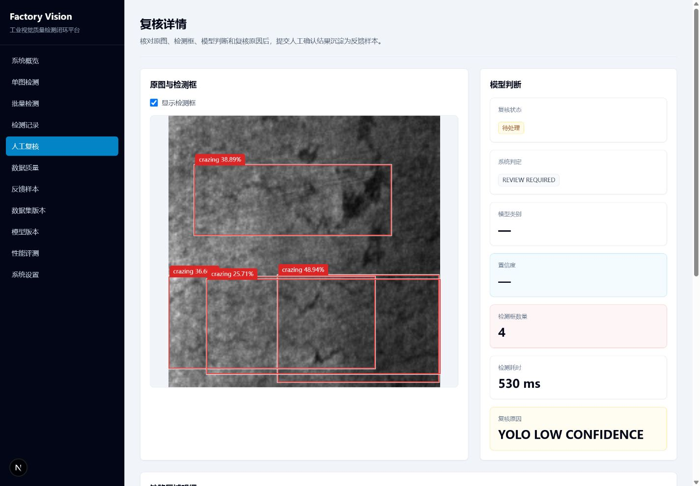
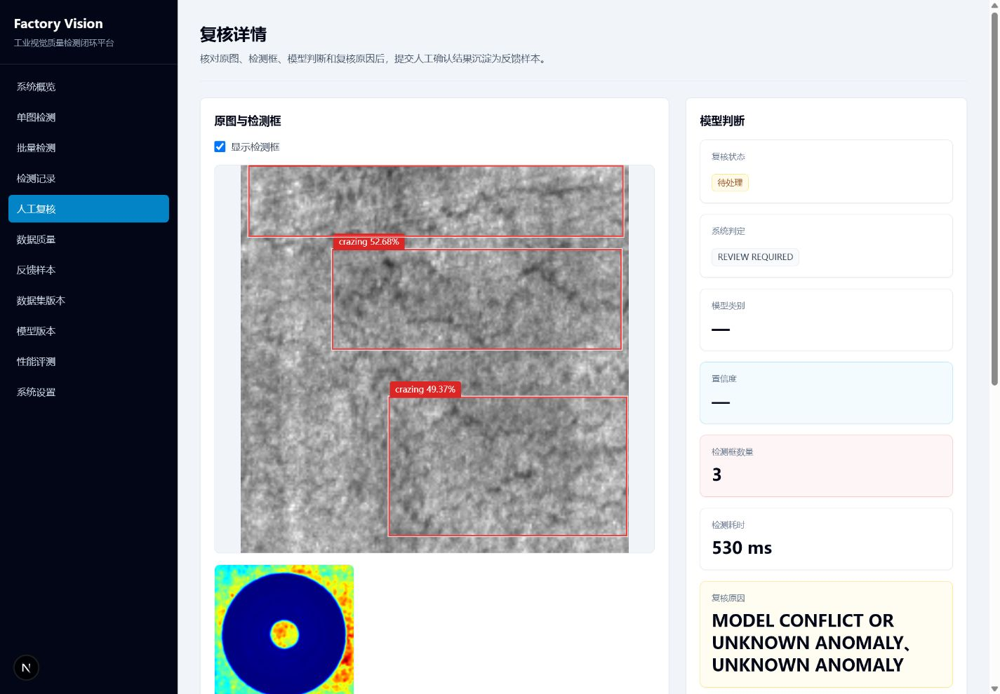
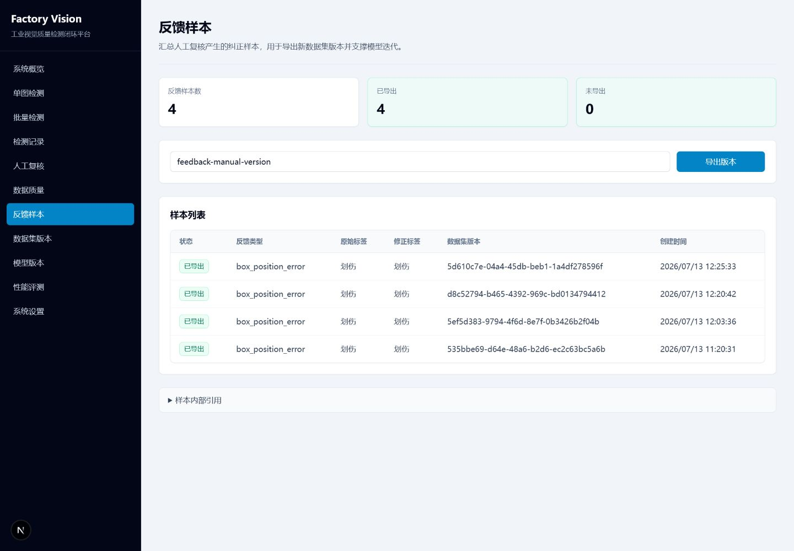
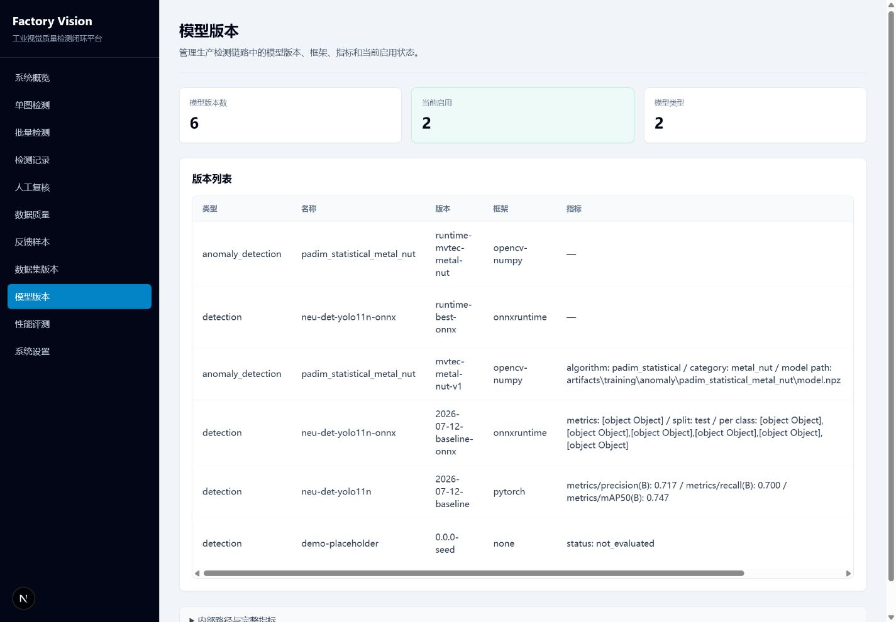
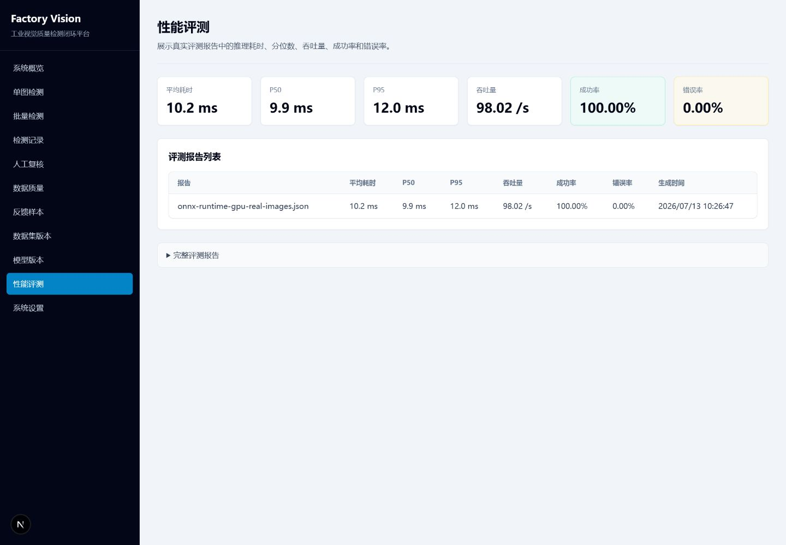
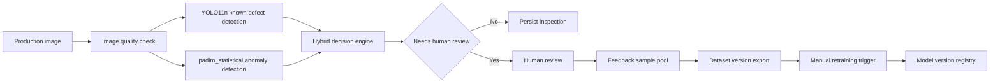

# Factory Vision Quality Loop

> 工业缺陷检测与质量闭环系统


Factory Vision Quality Loop 面向制造业视觉质检场景，把 YOLO11n 已知缺陷检测、工业异常识别、图片质量检查、人工复核、反馈样本池、数据集版本管理、模型注册和 ONNX 部署验证串成一个可运行的质量闭环系统。

它重点解决的问题不是“训练一个模型”，而是把模型预测、低置信度/高风险结果复核、人工修正、数据回流和版本追踪放进同一个工程流程。当前仓库展示的是可复现的工程闭环和真实评估结果，不包含工业相机、PLC、TensorRT、生产级 RBAC、自动训练上线或自动模型发布。



## What Is Implemented

- YOLO11n known-defect detection on NEU-DET, with PyTorch and ONNX artifacts verified locally.
- `padim_statistical` anomaly detection for MVTec AD `metal_nut`, implemented with OpenCV/NumPy statistical features.
- OpenCV image quality checks and classical vision baseline scripts.
- Hybrid inference that combines image quality, ONNX YOLO, anomaly detection and decision rules.
- Human review workflow that keeps the original model prediction and stores corrected results separately.
- Feedback sample generation and dataset version export, including duplicate-version HTTP 409 handling.
- Model registry with activation/rollback health checks.
- FastAPI backend, Next.js frontend, PostgreSQL Docker deployment and GitHub Actions CI.

## Screenshots

| Single Image Inspection | Human Review |
| --- | --- |
|  |  |

| Anomaly Heatmap | Feedback Samples |
| --- | --- |
|  |  |

| Model Registry | Benchmark |
| --- | --- |
|  |  |

## Architecture



## Verified Model Results

The numbers below come from real project reports summarized in [docs/reports/release-metrics-v1.0.0.json](docs/reports/release-metrics-v1.0.0.json). They are not paper benchmarks.

### YOLO11n On NEU-DET

| Metric | Independent test split |
| --- | ---: |
| Precision | 0.71686 |
| Recall | 0.70027 |
| mAP@0.5 | 0.74662 |
| mAP@0.5:0.95 | 0.43375 |

- Dataset: NEU-DET.
- Images/XML pairs: 1800 / 1800.
- Split: train 1261, val 359, test 180.
- Classes: `crazing`, `inclusion`, `patches`, `pitted_surface`, `rolled_in_scale`, `scratches`.
- Per-class mAP@0.5:0.95: crazing 0.15075, inclusion 0.47021, patches 0.56986, pitted_surface 0.50764, rolled_in_scale 0.32347, scratches 0.58054.

### Anomaly Detection

| Metric | Result |
| --- | ---: |
| Algorithm | `padim_statistical` |
| MVTec AD category | `metal_nut` |
| Train good samples | 220 |
| Test samples | 115 |
| Image-level AUROC | 0.73460 |
| Pixel-level AUROC | 0.44985 |
| Image-level F1 | 0.59701 |
| Pixel-level F1 | 0.11926 |
| Normal false positive rate | 0.04545 |
| Anomaly false negative rate | 0.56989 |
| Average inference time | 58.62 ms |

This is a custom OpenCV/NumPy statistical anomaly detector inspired by PaDiM-style workflows. It is not a full reproduction of the PaDiM paper.

### ONNX Runtime Benchmark

| Runtime | Batch | Avg latency | P95 latency | Throughput |
| --- | ---: | ---: | ---: | ---: |
| CPUExecutionProvider | 1 | 41.026 ms | 55.0858 ms | 24.3748 images/s |
| CPUExecutionProvider | 4 | 182.907 ms | 211.5462 ms | 21.8690 images/s |
| CUDAExecutionProvider | - | unavailable | unavailable | unavailable |

- ONNX model size: 9.9432 MiB.
- PyTorch and ONNX raw outputs are close, with max absolute difference `0.00198`.
- CUDA was requested in the audit environment, but ONNX Runtime fell back to CPU. CUDA is therefore documented as not verified.
- TensorRT is not implemented or validated.

### End-To-End HTTP Simulation

A production-line simulator made two real HTTP `hybrid` inference requests. Both succeeded and both entered human review.

| Metric | Result |
| --- | ---: |
| Total sent | 2 |
| Success count | 2 |
| Review required | 2 |
| Average HTTP response | 929.417 ms |
| P95 HTTP response | 933.582 ms |

This number is end-to-end HTTP workflow latency. It is not the same as ONNX single-model inference latency.

## Human Review And Data Loop

```text
Model original prediction
-> Decision engine
-> Review task
-> Human correction
-> Original prediction retained
-> Feedback sample
-> Dataset version export
```

- Human correction does not overwrite the model's original output.
- Corrected predictions are stored in review and feedback tables.
- Exporting the same `dataset_version` twice returns HTTP 409.
- The current system does not automatically retrain or automatically publish models.

## Quick Start

### Docker Compose

Docker mode is the recommended first run path. It uses PostgreSQL and CPU inference.

```powershell
Copy-Item .env.docker.example .env.docker
docker compose --env-file .env.docker up -d --build
docker compose ps
```

Open:

- Frontend: `http://localhost:3000`
- Swagger: `http://localhost:8000/docs`
- Health: `http://localhost:8000/api/v1/health`
- Ready: `http://localhost:8000/api/v1/ready`

The Compose file mounts `data/`, `artifacts/` and `configs/`. Full datasets and model weights are not committed to this repository. If model files are missing, model registration or inference endpoints return explicit missing-file errors instead of fake predictions.

If PostgreSQL logs show `password authentication failed`, an old Docker volume probably contains a different password. Use a new project name for verification, for example:

```powershell
docker compose -p fvql-local --env-file .env.docker up -d --build
```

Only remove old volumes after confirming the old database is no longer needed.

### Windows PowerShell Development

```powershell
conda env create -f environment.yml
conda activate factory-vision

Push-Location frontend
npm.cmd install
Pop-Location

Copy-Item .env.example .env
alembic upgrade head
python -m scripts.register_runtime_models

.\scripts\start-dev.ps1
.\scripts\stop-dev.ps1
```

The startup script uses `npm.cmd`, does not modify global PATH or PowerShell execution policy, and checks that backend/frontend endpoints are reachable before reporting ready.

### Manual Local Startup

Backend:

```powershell
conda activate factory-vision
alembic upgrade head
python -m scripts.register_runtime_models
python -m uvicorn backend.app.main:app --host 127.0.0.1 --port 8000
```

Frontend:

```powershell
Push-Location frontend
$env:NEXT_PUBLIC_API_BASE_URL = "http://localhost:8000/api/v1"
npm.cmd run dev -- --port 3000
Pop-Location
```

## Verification Commands

Backend:

```powershell
python -m pytest
python -m ruff check .
python -m mypy
python -m compileall backend scripts
```

Frontend:

```powershell
Push-Location frontend
npm.cmd run lint
npm.cmd run typecheck
npm.cmd run build
Pop-Location
```

Docker:

```powershell
docker compose --env-file .env.docker config
docker compose --env-file .env.docker build
docker compose --env-file .env.docker up -d
docker compose --env-file .env.docker ps
```

## Project Structure

```text
backend/      FastAPI APIs, domain models, inference, inspection and quality-loop services
frontend/     Next.js management UI
configs/      Data, training, detection, anomaly, Docker and hybrid inference config
scripts/      Data preparation, training, evaluation, registration, startup and simulation scripts
docs/         System design, model evaluation, deployment, demo and interview material
data/         Local data mount point; complete datasets are ignored
artifacts/    Local training/evaluation/runtime outputs; ignored by Git
```

## Data And Model Files

NEU-DET and MVTec AD are not redistributed in this repository. Use the scripts in `scripts/download_neu_det.py`, `scripts/prepare_neu_det.py`, `scripts/split_detection_dataset.py` and `scripts/download_mvtec_ad.py` to prepare local data.

Expected local model paths:

- YOLO PyTorch: `artifacts/training/neu_det_baseline/weights/best.pt`
- YOLO ONNX: `artifacts/training/neu_det_baseline/weights/best.onnx`
- Anomaly detector: `artifacts/training/anomaly/padim_statistical_metal_nut/model.npz`

Model weights are intentionally not committed. If model distribution is needed later, use GitHub Releases or an external model registry rather than committing large binary weights to Git.

## Documentation

- [System design](docs/system-design.md)
- [Model evaluation](docs/model-evaluation.md)
- [ONNX deployment](docs/onnx-deployment.md)
- [Anomaly detection](docs/anomaly-detection.md)
- [Hybrid inference](docs/hybrid-inference.md)
- [Data loop](docs/data-loop.md)
- [Docker deployment](docs/docker-deployment.md)
- [Demo script](docs/demo-script.md)
- [Final audit report](docs/final-audit-report.md)

## Known Limitations

- Detection boxes can be displayed and edited through JSON/form coordinates, but graphical drag editing is not implemented.
- Anomaly detection is validated only on MVTec AD `metal_nut`, and the metrics are limited.
- ONNX CUDA is not verified in the current report.
- TensorRT and Docker GPU are not verified.
- No industrial camera, PLC, production RBAC, Prometheus/Grafana or MLflow integration.
- No automatic retraining, automatic model publishing or canary rollout service.
- Production-line simulation is HTTP-level simulation, not a real factory takt-time measurement.

## Future Work

- Graphical bounding-box editing.
- Additional MVTec AD categories and stronger anomaly detection models.
- Camera/PLC integration.
- Observability with Prometheus/Grafana.
- MLflow or registry-backed model lifecycle.
- RBAC and deployment hardening.
- Release-based model artifact distribution.
