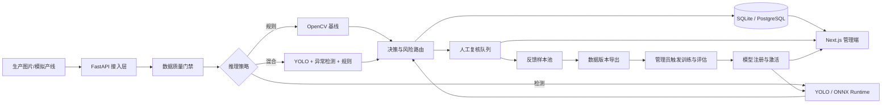

# Factory Vision Quality Loop 项目规划

> 文档状态：第一阶段环境审计与方案设计
> 审计日期：2026-07-12
> 本阶段边界：不创建业务代码、不下载数据集、不安装依赖、不训练或评估模型。

## 1. 项目目标与成功标准

Factory Vision Quality Loop 是面向制造业表面缺陷质检的完整 AI 应用系统。系统将数据质量检查、传统视觉、已知缺陷检测、未知异常检测、低置信度人工复核、反馈样本回流、数据与模型版本管理、部署和运营指标串成可审计的质量闭环。

项目成功不以“能够上传图片”为标准，而以以下可验证能力为标准：

- 同一套接口支持规则、检测与混合三种推理策略，并记录决策依据。
- 低置信度、模型冲突、图像质量问题和高风险类别可进入人工复核。
- 人工纠正形成可追溯反馈样本，可导出为新数据版本，但不无人值守自动训练。
- PyTorch 与 ONNX Runtime 结果能够做一致性检查，部署基线为 ONNX Runtime。
- 训练、评估和 benchmark 只记录真实执行结果；没有结果时保留明确的待测字段。
- Windows 11 本地优先可运行，同时提供 PostgreSQL/Docker 部署路径。

## 2. 当前目录与环境审计

### 2.1 仓库状态

- 初始项目目录在阶段一审计时为空。
- 当前目录不是 Git 仓库，`git status --short --branch` 返回 `fatal: not a git repository`。
- 未发现 `AGENTS.md` 或既有项目文件，因此本阶段创建 `docs/project-plan.md` 不会覆盖已有实现。
- Git 客户端为 `2.49.0.windows.1`。

### 2.2 Conda 与 Python

Conda 版本为 `24.11.3`，当前激活 `base`：

| 环境 | Python | 与项目相关的已发现模块 | 判断 |
|---|---:|---|---|
| `base` | 3.12.7 | torch、torchvision、FastAPI、SQLAlchemy | 不建议复用：PyTorch 为 CPU 构建，且 pip 报告损坏的 scikit-learn distribution |
| `RAG` | 3.12.13 | torch、ONNX Runtime、FastAPI、SQLAlchemy | 定位与本项目不同，缺 OpenCV、Ultralytics、anomalib |
| `ai-lab` | 3.9.21 | torch、torchvision、OpenCV、Ultralytics、FastAPI、SQLAlchemy | 最接近视觉需求，但 Python 低于目标版本，缺 ONNX Runtime/anomalib，探测时出现访问/OpenCL 告警 |
| `nlp_env` | 3.9.21 | torch、FastAPI | 定位与依赖均不匹配 |
| `pyqt5env` | 3.9.13 | 无主要项目依赖 | 不匹配 |

`base` 中检测到 `torch 2.5.1+cpu`，`torch.version.cuda=None`，`torch.cuda.is_available()=False`。这说明 NVIDIA 驱动正常并不等于当前 Python 环境拥有 CUDA PyTorch。

**复用结论：** 不直接复用或修改现有环境。下一阶段建议只新建一个项目专用 Conda 环境 `factory-vision`，Python 3.11，并在其中统一安装后端、ML、测试依赖。这样比修补 `base` 或升级 `ai-lab` 的 Python/二进制依赖更可复现，也不会破坏用户已有任务。创建环境前先生成并审阅锁定方案；不创建多个重复环境。

### 2.3 GPU、CUDA 与部署条件

- GPU：NVIDIA GeForce RTX 4060 Laptop GPU。
- 显存：8188 MiB。
- 驱动：572.83；`nvidia-smi` 报告最高支持 CUDA 12.8。
- 审计时 GPU 空闲，约 17 MiB 显存占用。
- `nvidia-smi` 的 CUDA 版本是驱动能力上限，不代表本机已安装对应 CUDA Toolkit，也不规定 PyTorch/ONNX Runtime 必须使用 12.8 构建。
- 后续应分别验证 CUDA PyTorch 和 `onnxruntime-gpu` provider，不能仅依据 `nvidia-smi` 声称 GPU 推理可用。
- 8GB 显存适合小型 YOLO、较小 batch 和单类别 MVTec AD 实验；训练配置必须允许自动减小 batch，TensorRT 保持可选。

### 2.4 前端工具链

- Node.js：`v22.20.0`。
- PowerShell 执行策略阻止加载 `npm.ps1`；后续 Windows 命令统一使用 `npm.cmd`，无需修改全局执行策略。
- 下一阶段应确认所选 Next.js 版本对 Node 22 的支持，并通过 lockfile 固定依赖。

## 3. 系统架构方案

采用“模块化单体后端 + 独立 ML 工具链 + Next.js 前端”。MVP 不拆微服务，以降低本地部署、事务一致性和调试成本；推理接口通过抽象层隔离，未来可独立部署。



### 3.1 后端边界

- `api`：HTTP 路由、请求校验、统一响应与错误映射，不承载业务规则。
- `services`：检测编排、复核状态机、反馈导出、模型激活和仪表盘聚合。
- `repositories`：数据库访问，避免 API 和推理代码直接操作 ORM session。
- `models`：SQLAlchemy 持久化模型；`schemas`：Pydantic 输入输出，两者分离。
- `inference`：统一 provider 协议，封装 OpenCV、PyTorch、ONNX Runtime 和异常检测实现。
- `core`：配置、日志、request ID、异常、生命周期与安全边界。

统一响应建议使用 `{success, data, error, request_id, timestamp}`。错误码采用稳定业务码，例如 `IMAGE_INVALID`、`MODEL_NOT_READY`、`REVIEW_STATE_CONFLICT`，HTTP 状态码表达传输语义。

### 3.2 数据与审计

- 本地 SQLite，Docker 使用 PostgreSQL；SQLAlchemy 2.x + Alembic 管理迁移。
- JSON 字段用于边界框、指标和类别分布；关键筛选字段仍使用独立列和索引。
- 模型激活使用事务保证同一模型类型只有一个生效版本；旧版本不可覆盖。
- 复核采用明确状态机：`pending -> approved/corrected/rejected`，终态修改需审计。
- 图片和模型文件不写数据库，只存相对路径、校验和、元数据；大文件默认 Git 忽略。
- 所有变更操作写 `audit_logs`，request ID 串联 API、推理和审计记录。

### 3.3 推理与质量路由

三种模式共享标准化结果协议：检测框、类别、置信度、异常分数、热力图路径、耗时、模型版本、质量告警和复核原因。

混合模式先做质量门禁与 YOLO，按配置决定是否运行异常检测。以下任一条件触发复核：最高置信度低、未知异常分数高、检测与异常结果冲突、图片质量不达标、高风险类别命中。每条原因使用机器可读枚举并附人类可读说明，避免只能看到一个布尔值。

### 3.4 ML 实验可复现性

- YAML 保存数据、训练、阈值和导出参数。
- 每次实验落盘数据版本、Git commit、随机种子、Python/PyTorch/CUDA、完整配置、耗时、最佳权重路径和真实指标。
- NEU-DET 用于已知缺陷检测；MVTec AD 首选单类别配合 PatchCore。数据不可用时才替换，并记录来源、许可和原因。
- ONNX 导出后对同一批样本执行数值/检测结果一致性检查。
- benchmark 预热后统计平均、P50/P95/P99、FPS、吞吐量、CPU/GPU 资源和模型大小；不可用 provider 显式记为 skipped，而非填零。

## 4. 分阶段实施计划

每个阶段只进入约定范围，结束时运行对应测试并按固定格式汇报。

### 阶段 1：环境审计与方案设计（本阶段）

- 审计目录、Conda、Python、pip、GPU/CUDA、Git、Node。
- 确定环境复用策略、系统边界、目录、里程碑和风险。
- 交付本规划文档；不初始化完整项目，不安装依赖。

验收：所有结论有命令证据；仅新增规划文档。

### 阶段 2：工程骨架与可运行后端基线

- 初始化 Git、`.gitignore`、环境文件、`pyproject.toml`、pre-commit、日志和配置。
- 建立 FastAPI、SQLAlchemy/Alembic、SQLite、统一响应/异常/request ID。
- 实现 health/ready 与最小数据库迁移和测试。
- 建立 CI、Docker 基线；先不接模型。

验收：环境可复现，迁移可升降，health API、lint、类型检查和测试真实通过。

### 阶段 3：数据质量与传统视觉

- 实现 15 项数据检查、JSON/HTML 报告和问题样本可视化。
- 完成可配置 OpenCV 流水线、特征提取、CLI 和单元测试。
- 提供 NEU-DET/MVTec AD 数据说明与格式转换骨架，不提交完整数据。

验收：用自生成小图和合法/非法标注覆盖损坏、重复、模糊、曝光、越界、空标注、泄漏等场景。

### 阶段 4：已知缺陷检测与部署导出

- 完成数据转换、YOLO 配置、训练/验证/推理脚本、评估与错误案例导出。
- 导出 ONNX，接入 ONNX Runtime CPU/CUDA，执行 PyTorch/ONNX 一致性检查。
- 只在真实数据训练后写指标。

验收：小规模 smoke run 可执行；训练记录完整；ONNX provider 和一致性结果有真实日志。

### 阶段 5：异常检测与混合推理

- 集成 PatchCore（优先）训练、推理、热力图和 image/pixel 指标。
- 实现三种推理策略、风险路由和复核原因。
- 接入单图、批量和查询 API。

验收：使用受控样本验证每条复核规则和降级路径；模型未就绪时返回明确错误。

### 阶段 6：人工复核、反馈回流与模型注册

- 实现复核状态机、框/类别纠正、反馈池、数据版本导出。
- 实现模型注册、指标查询、激活与回滚，关联检查记录。
- 禁止无人值守自动重训，只提供管理员命令和审计记录。

验收：API 集成测试覆盖并发状态冲突、重复提交、数据版本生成与模型切换。

### 阶段 7：Next.js 管理端

- 建立严格 TypeScript、Tailwind、API client 和演示身份入口。
- 实现概览、检测、复核、质量报告、回流、数据版本、模型版本、benchmark 和设置页面。
- demo seed 明确标记且与真实 API 数据分离。

验收：页面通过真实后端接口完成核心闭环；错误、加载和空状态可见；前端 lint/typecheck/build 通过。

### 阶段 8：benchmark、产线模拟与交付文档

- 完成统一 benchmark、产线模拟器、断点与去重。
- 完善 Docker Compose、CI、README、架构/API/演示/面试/简历文档。
- 录入且只录入真实运行得到的指标和截图。

验收：全新环境按 README 可运行；演示脚本可走通“检测—复核—回流—版本”闭环。

## 5. 计划中的最终目录结构

以下是目标结构，不代表本阶段已经创建：

```text
factory-vision-quality-loop/
├── backend/
│   ├── app/
│   │   ├── api/v1/
│   │   ├── core/
│   │   ├── db/
│   │   ├── models/
│   │   ├── schemas/
│   │   ├── repositories/
│   │   ├── services/
│   │   ├── inference/providers/
│   │   └── main.py
│   ├── alembic/
│   └── tests/
├── frontend/
│   ├── app/
│   ├── components/
│   ├── lib/
│   ├── types/
│   └── tests/
├── ml/
│   ├── common/
│   ├── data_quality/
│   ├── classical_vision/
│   ├── detection/
│   ├── anomaly_detection/
│   ├── evaluation/
│   ├── export/
│   └── benchmark/
├── configs/
│   ├── data_quality/
│   ├── classical_vision/
│   ├── detection/
│   ├── anomaly/
│   └── inference/
├── scripts/
├── tests/
├── docs/
│   ├── project-plan.md
│   ├── decisions.md
│   ├── architecture.md
│   ├── api.md
│   ├── resume-description.md
│   ├── interview-guide.md
│   ├── demo-script.md
│   ├── system-design.md
│   ├── model-evaluation.md
│   └── data-loop.md
├── data/
│   ├── README.md
│   ├── samples/
│   ├── raw/
│   ├── interim/
│   └── processed/
├── artifacts/
│   ├── reports/
│   ├── visualizations/
│   └── benchmarks/
├── models/
│   ├── pytorch/
│   ├── onnx/
│   └── tensorrt/
├── docker/
├── .github/workflows/
├── .env.example
├── .gitignore
├── .pre-commit-config.yaml
├── alembic.ini
├── docker-compose.yml
├── environment.yml
├── pyproject.toml
├── scripts.ps1
└── README.md
```

`data/raw`、训练产物、模型权重、运行数据库、日志和大体积报告将由 `.gitignore` 排除；只提交说明、小型许可样例、配置和可复现脚本。

## 6. 关键技术风险与缓解措施

| 风险 | 影响 | 缓解措施 |
|---|---|---|
| Windows 下 PyTorch、ONNX Runtime GPU、CUDA DLL 组合不兼容 | GPU provider 加载失败 | Python 3.11 单环境；按官方兼容矩阵固定版本；分别做 provider smoke test；保留 CPU 明确降级路径 |
| `onnxruntime` 与 `onnxruntime-gpu` 同时安装 | provider/动态库冲突 | 环境中二选一；目标开发环境安装 GPU 包并验证 `CUDAExecutionProvider` |
| anomalib 与 PyTorch/torchvision 版本耦合 | 安装冲突或运行失败 | 在锁定核心视觉栈前做最小兼容性实验；必要时隔离异常检测依赖，但不预先创建第二环境 |
| 8GB 显存不足 | OOM、训练慢 | 小模型、单类别异常检测、可配输入尺寸/batch、AMP、梯度累积和 CPU fallback |
| 工业数据少且类别不均衡 | 指标波动、漏检高 | 分层划分、数据版本化、按类指标、增强/采样策略、阈值按风险调优 |
| 同源图片进入训练与验证 | 指标虚高 | 使用内容哈希和来源/批次分组划分，泄漏检查在训练前作为门禁 |
| NEU-DET 标注格式/授权来源差异 | 转换错误、无法复现 | 记录下载来源与校验和；转换后画框抽检；保留原始数据只读 |
| 异常检测域偏移 | 未知缺陷误报高 | 只用代表性正常样本建库；按产线/工位校准阈值；结合规则与复核，而非单模型自动放行 |
| 复核和反馈状态不一致 | 重复导出、错误标签污染 | 数据库事务、状态机、幂等键、审计日志、导出快照与校验和 |
| SQLite 并发写限制 | 批处理/复核冲突 | 本地控制写并发；Docker/多人场景切 PostgreSQL；仓储层保持数据库可替换 |
| PowerShell 阻止 `npm.ps1` | 前端命令无法运行 | Windows 文档和脚本使用 `npm.cmd`，不要求用户降低系统执行策略 |
| 指标被误当成真实生产结果 | 简历可信度受损 | 指标文件带数据版本和 commit；文档缺省写“待实际运行后填写”；禁止 seed 数据进入指标 |
| 项目范围过大 | 功能多但不可运行 | 阶段验收、纵向闭环优先；每阶段只扩展一个可测试能力面 |

## 7. 下一阶段建议与进入条件

建议下一阶段仅实施“工程骨架与可运行后端基线”。进入前确认：

1. 允许创建一个 `factory-vision` Conda Python 3.11 环境并安装锁定依赖。
2. 选择项目初始化 Git 的默认分支名（建议 `main`）。
3. 先以 SQLite 和无真实模型的明确 `not ready` 状态打通服务，不伪造检测结果。

下一阶段首轮验证应至少包含：Python/CUDA provider smoke test、FastAPI health/ready、SQLite 迁移、request ID、统一异常响应、ruff、mypy、pytest。模型训练、完整前端和数据集下载仍不进入该阶段。

## 8. 本阶段命令记录

```powershell
conda info --envs
python --version
python -m pip list
nvidia-smi
git status --short --branch
Get-ChildItem -Force
conda run -n <env> python -c "...模块探测..."
python -c "...PyTorch CUDA 探测..."
node --version
npm --version
git --version
conda --version
```

说明：`npm --version` 因 PowerShell 执行策略失败；这是已记录的工具调用结果，不是 npm 缺失。`ai-lab` 的 CUDA 深入探测未产生可靠输出，因此本文件不对其 GPU 可用性作推断。
